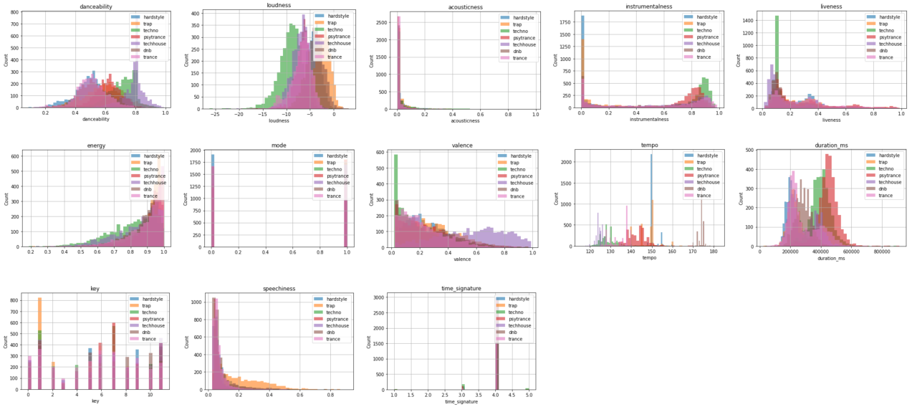
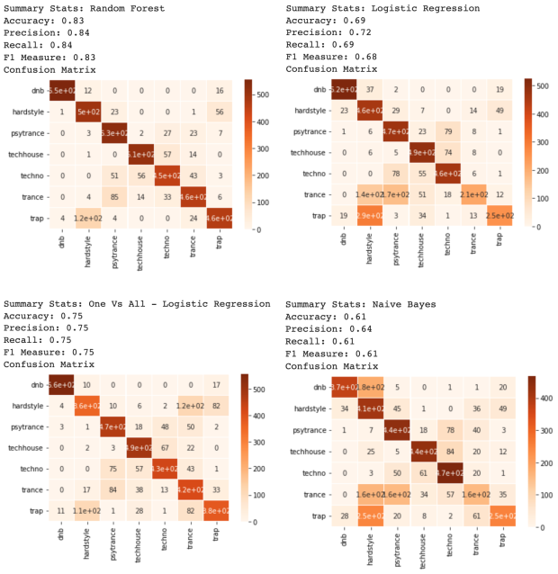
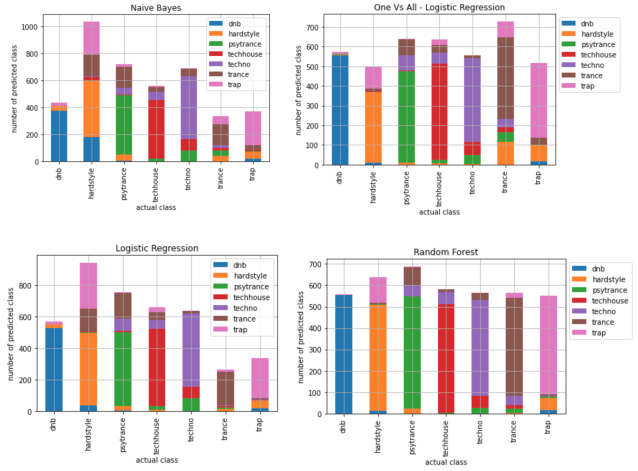

# DSCI 632 Project: EDM Songs Classification with Pyspark

## Abstract
The team consists of two team members with unique backgrounds and skill sets who will be using this opportunity to polish their data science skills specifically using Pyspark, MLlib and derive conclusive results from the data. The dataset is a collection of 21,000 electronic dance music from 7 unique categories. Each row of the dataset represents a song, and each row has 13 audio features. The purpose of the project is to automatically classify the genre of a given song using machine learning algorithms for easier organizing the song library. Random Forest, Naive Bayes, Logistic Regression, and One Vs All machine learning algorithms were trained and tested on the dataset. The statistics results, as well as confusion matrices, were generated to compare between the models. Random Forest model produced the highest accuracy, precision, recall, and F-measure equally at 0.84. Additionally, drum and bass (dnb) genre was labeled most accurately among all seven categories.

Here are the features distribution plots for the data.

## data

The edm.songs.csv is a collection of 21,000 EDM songs from 7 unique categories including hardstyle, trap, techno, psytrance, techhouse, drum and bass, and trance. Each row of the dataset represents a song, and each row has 13 audio features. The audio features are the measurements of danceability, energy, key, loudness, mode, acousticness, instrumentalness, speechiness, liveness, valence, tempo, time signature, and duration. The dataset is completely balanced with 3,000 observations for each category. The dataset was originally constructed using Spotify’s API by Travis Wolf (Wolf 2020). The final dataset which was used in this project was generated on February 2022.

## Notebook 

edm.ipynb contains all the main work of machine learning in Pyspark for multiple song genre classification task. Four models from pyspark.ml library are used: Random Forest, Naive Bayes, Logistic Regression, One-vs-All - Logistic Regression.

Here are the Confusion Matrix plots of each model

Here are the predicted error bar plots for each model

## Future Work

It is desired to migrate this notebook to GCP(Google Cloud Platform)'s Dataproc to scale up the work, and reduce time and computing power for larger dataset in the future.

## For More Information

For any additional questions, please contact [Dayun Piao](https://github.com/claude0124), [Tien Nguyen](https://github.com/tien011)